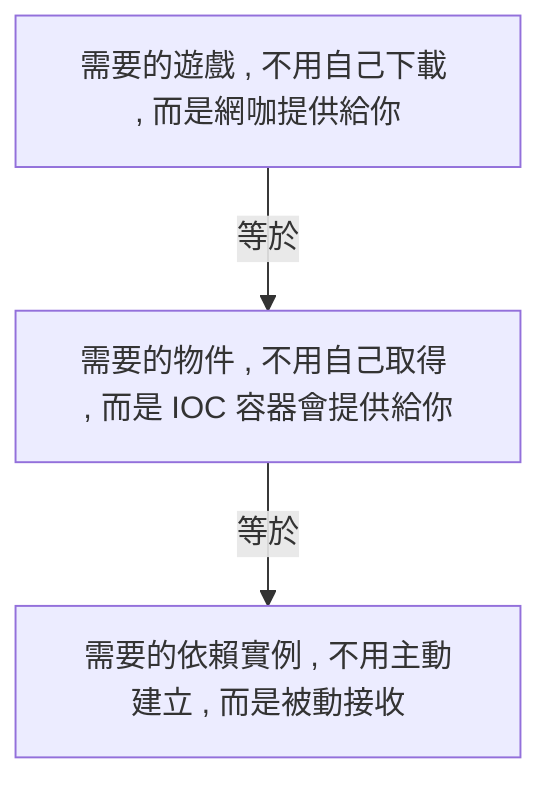
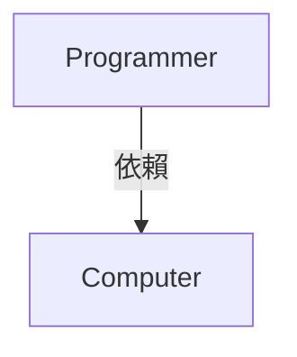
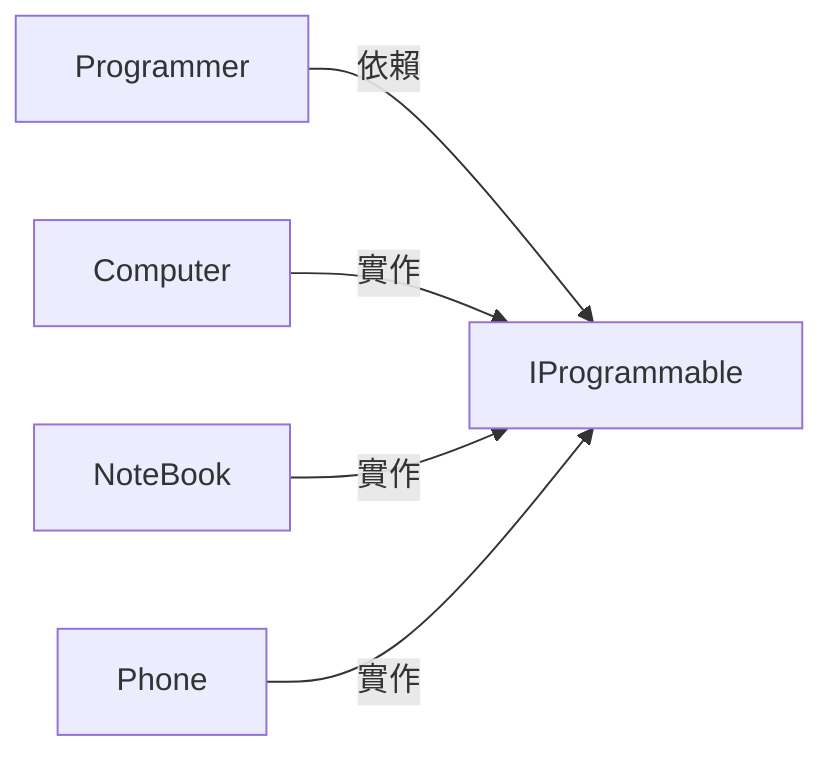
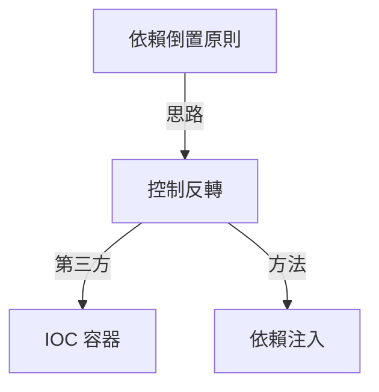

# 控制反轉(Inversion of Control)與依賴注入(Dependency Inversion)
## 控制反轉(Inversion of Control)

### [ IOC 定義](https://en.wikipedia.org/wiki/Inversion_of_control)
> In software engineering, inversion of control (IoC) is a programming principle. IoC inverts the flow of control as compared to traditional control flow. In IoC, custom-written portions of a computer program receive the flow of control from a generic framework. A software architecture with this design inverts control as compared to traditional procedural programming: in traditional programming, the custom code that expresses the purpose of the program calls into reusable libraries to take care of generic tasks, but with inversion of control, it is the framework that calls into the custom, or task-specific, code.

#### IOC 是一種設計程式的程式設計原則 , 目標是反轉高位模組對於依賴低位模組的『**控制流程 (Control Flow)**』.
舉個例子 : A 物件裡有使用 B 物件 , 為 A 依賴 B 的關係 , 在傳統的作法上 , A 需要直接對 B 做流程控制後(比如說 new ) 才能使用 B , 這會讓 A 和 B 有一定程度的耦合 , 所以 IOC 希望透過某種方式反轉這樣的控制關係. 讓 A 不需要對 B 做流程控制. 但又可以使用 B.

> In traditional programming, the flow of the business logic is determined by objects that are statically bound to one another. With inversion of control, the flow depends on the object graph that is built up during program execution. Such a dynamic flow is made possible by object interactions that are defined through abstractions. This run-time binding is achieved by mechanisms such as dependency injection or a service locator. In IoC, the code could also be linked statically during compilation, but finding the code to execute by reading its description from external configuration instead of with a direct reference in the code itself.

#### 反轉控制流程的關鍵在於高位模組取得低位模組是使用靜態綁定(Statically binding)還是動態綁定(Dynamic binding) 哪一種方式!?

##### 靜態綁定(Statically Bound or Early Binding)
```C#
// 程式碼在編譯時 , 就知道其物件的真實型別.
public class 高位模組 {
    public 高位模組(){
        IDog dog = new 哈士奇();
    }
}
```
##### 動態綁定(Dynamic Binding or Late Binding)
```C#
// 程式碼在執行時 , 才知道其物件的真實型別.
public class 高位模組 {
    public 高位模組(){
        IDog dog = new CreateDogFactory().CreateDog(typeof(哈士奇);
    }
}

public class CreateDogFactory {
    public IDog CreateDog(Type dogType) 
        => (IDog)Activator.CreateInstance(dogType);
}
```

### IOC 只是一個設計程式的設計原則
IOC 只是一個設計程式的設計原則 , 代表實現它的方式非常多 , 像是 [Service Locator Pattern](https://en.wikipedia.org/wiki/Service_locator_pattern) 或是 [Factory Pattern](https://en.wikipedia.org/wiki/Factory_method_pattern) 以及 [Dependency injection](https://en.wikipedia.org/wiki/Dependency_injection) 等等方式都可能實現它 , 只要這種實現方式可以讓高位模組不需要對低位模組作流程控制 , 就可以稱 它滿足 IOC 的要求.     
而目前 IOC 的實現方式基本上是將流程的控制交給第三方 (通常是 IOC 容器) 專門負責 (我覺得這也可以直接當作 IOC 的定義).
- 控制反轉是把原本高位模組對低位模組的控制權移交給第三方容器
- 降低高位模組對低位模組的耦合性 , 讓雙方都倚賴第三方容器
- 舉個例子 : A 物件裡有使用 B 物件以及 C 物件 , 為 A 依賴 B & C 的關係. 但 A 不需要自己建立並設定 B & C , 而是透過 IOC 容器建立並設定 B & C 後 , 在透過某種方式丟給 A.
     

### 所以為什麼要用 IOC !? 讓高位模組將流程控制交給第三方處理有甚麼好處 ?!
#### 在我們使用 IOC 之前 , 我們的程式是長這個樣子.
    
齒輪組中齒輪之間的齧合關係與軟體系統中物件之間的耦合關係非常相似.     
程式內所使用的物件就像多個齒輪一樣 , 彼此協同工作 , 但是互相耦合 , 當一個零件無法運作時 , 整個程式就崩潰了. 當一個程式的耦合越高 , 則代表此程式越容易發生牽一髮而動全身的情形.     
- 舉個例子 , 假設要讓 A 物件正常運作需要先正確建立以及設定 B 物件 , 要讓 B 物件正常運作需要先正確建立以及設定 C 物件 , 要讓 C 物件正常運作需要先正確建立以及設定 D 物件. 而這中間只要有一個物件無法正確建立 , 則都會影響到 A 物件的運作. 所以我們為了要可以讓 A 物件正常運作 , 可能就**必須去知道 B、C、D 應該如何正確地建立.**

#### 當我們開始使用 IOC 容器後
    
如圖 , 因為齒輪之間的轉動已經全部都依賴第三方(IOC 容器). 也就是說所有物件的控制權都是由 IOC 容器負責 , IOC 容器將作為整個系統的關鍵核心 , 發揮 "粘合劑" 的功用 , 將程式中所有的物件粘合在一起共同運作. 若沒有這個粘合劑 , 則物件與物件之間彼此會失去聯繫. 所以開發高位模組時 , 只需要知道高位模組內相依的物件可以從 IOC 容器中取得即可.
#### 假設把 IOC 容器拿掉
    
若把 IOC 容器拿掉 , 可以發現 A、B、C、D 這四個物件彼此之間並沒有直接的耦合.
舉例來說 : 在尚未使用 IOC 容器之前 , 若 A 物件需要 B 物件的功能 ( A 物件相依於 B 物件) ,  ,  A 物件必定要在初始化或是程式執行到某一點的時候 , 自己主動去**正確地建立以及設定** B 物件. 也就是說 A 物件有**正確地建立以及設定**  B 物件的責任 , 因為 A 物件有這個控制權     
但當使用 IOC 容器後. A 物件就不具備這個控制權了(自然也不需要承擔這個責任) , 這個控制權將由 IOC 容器負責. 當 A 物件需要 B 物件的時候，IOC 容器會主動建立一個 B 物件並將之傳遞(注入)到 A 物件內, 同理 , IOC 容器為了建立 B 物件 , 也會再去將其相依的物件建立後傳給 B. 所以開發 A 類別的時候 , **不需要特別去考慮關於與其相依的所有類別應該如何初始化.**

### IOC 概念例子
舉個例子 : 
我們以前高中常常翹課跑去網咖打電動!?     
但那些遊戲是需要你自己去找遊戲載點來下載安裝的嬤!?     
肯定不是 , 基本上網咖都會提供到好~~~~

- **實例依賴物件的控制流程 , 由主動變成被動** <-- 控制權顛倒了 , 這也正是 IOC 這個名稱的由來
- 使用 IOC 容器後進行開發 , 開發者不需要去擔心依賴物件的初始化建立 . 僅需要透過 IOC 容器取得所需要的依賴物件後並使用即可.  就像你去網咖 , 你也不會管遊戲哪來的 , 可以玩就好XD.

### 簡單 IOC 容器範例
#### IOC 容器實作方式
```C#
public class MyContainer
{
    private readonly Dictionary<Type, Type> _types = new Dictionary<Type, Type>();

    public void Register<TKey, TImplementation>() where TImplementation : TKey
        => _types[typeof(TKey)] = typeof(TImplementation);

    public object Create(Type type)
    {
        var defaultConstructor = _types[type].GetConstructors()[0]; //Find a default constructor using reflection
        var defaultParams = defaultConstructor.GetParameters(); //Verify if the default constructor requires params
        var parameters = defaultParams.Select(param => Create(param.ParameterType)).ToArray(); //Instantiate all constructor parameters using recursion
        return defaultConstructor.Invoke(parameters);
    }
}
```
#### IOC 容器使用範例
```C#
public interface IMyApp
{
    void OutputString(string name);
}

public class MyApp : IMyApp
{
    private readonly IWriter _writer;
    public MyApp(IWriter writer) => _writer = writer;
    public void OutputString(string text) => _writer.Write($"you output {text}!");
}

public interface IWriter
{
    void Write(string s);
}

public class ConsoleWriter : IWriter
{
    public void Write(string s) => Console.WriteLine(s);
}

internal static class Program
{
    private static void Main(string[] args)
    {
        // Create IOC Container
        var container = new MyContainer();
        // Register Type
        container.Register<IWriter, ConsoleWriter>();
        container.Register<IMyApp, MyApp>();
        // Get MyApp Instance from IOC Container
        // 高位模組不需要自己 new MyApp 以及 ConsoleWriter 以及設定它們. 就可以使用它們
        var myApp = container.Create(typeof(IMyApp)) as IMyApp;
        myApp.OutputString("QQQ"); //<--- you output QQQ!
        Console.ReadKey();
    }
}
```

## 依賴注入 (Dependency Injection)
### DI 定義
將高位模組所需的低位模組注入(提供)到高位模組中.

- 控制反轉是一種概念 , 希望可以**反轉高位模組對於依賴低位模組的『控制流程 (Control Flow)**』
- 依賴注入是透過某種方式把高位模組所需要的低位模組提供給高位模組.
- 所以可以把依賴注入想成是控制反轉的其中一種實作方式. 因為高位模組不需要自己產生低位模組 , 低位模組會透過某種方式被提供給高位模組. 而這就滿足了控制反轉所需要達成的目標.

### 注入方式
- 建構子注入
    ```C#
    // 先在 IOC 容器註冊 IMyApp & MyApp 以及 IWriter & ConsoleWriter 
    
    public class MyApp : IMyApp
    {
        private readonly IWriter _writer;
        // ConsoleWriter 會透過建構子被注入到 MyApp 中
        public MyApp(IWriter writer) => _writer = writer;
        public void OutputString(string text) => _writer.Write($"you output {text}!");
    }

    public interface IWriter
    {
        void Write(string s);
    }

    public class ConsoleWriter : IWriter
    {
        public void Write(string s) => Console.WriteLine(s);
    }
    ```
    - 透過建構子將高位模組(MyApp) 的低位模組(ConsoleWriter) 提供給高位模組(MyApp)
- 屬性注入
- 方法注入

## 依賴反轉 (Dependency Inversion)
### 依賴
依賴就像是我們 Programmer 需要 Computer 才可以 Coding , 所以我們依賴 Computer, 沒有 Computer , 我們就什麼都不是了...


```C#
public class Computer
{
    public void Program() => throw new NotImplementedException();
}

public class Programmer
{
    private readonly Computer _computer;
    public Programmer(Computer computer) => _computer = computer;
    public void Coding() => _computer.Program();
}
```
- 在這個例子中 Programmer 是上層模組 , Computer 是下層模組.
- Programmer 依賴了 Computer 就代表 Programmer 需要知道 Computer 內有什麼方法可以呼叫. 比如說 Program() 之類的 , 若是 Computer 內刪除或是修改了某些方法的話. e.g. Program()改成 WriteProgram() , 代表 Programmer 要跟著修改.
- Programmer 需要使用 Computer 才可以 Coding. 但 Programmer 真的需要知道自己使用的機器是什麼嗎 !? 若某個機器 , 它擁有跟 Computer 一樣的能力 (Program) , Programmer 是不是也可以 Coding 呢!? 所以 Programmer 真正依賴的是否為某種具有 Program 能力的機器呢 !?
### 依賴反轉定義
> 1. High-level modules should not depend on low-level modules. Both should depend on abstractions.
> 2. Abstractions should not depend on details. Details should depend on abstractions.
> - 高階模組不應該依賴於低階模組 , 兩者都該依賴抽象.
> - 抽象不應該依賴於具體實作方式. 具體實作方式則應該依賴抽象.

#### 高階模組不應該依賴於低階模組 , 兩者都該依賴抽象.
- 新增一個抽象(IProgrammable) , 讓高低位模組皆依賴於它. 然後我們會發現高位模組與低位模組的依賴方向被顛倒了. 由 高位-->低位 變成 高位-->抽象<--低位. 這就是依賴反轉名稱的由來.
    ```mermaid
    graph LR;
    A[Programmer] 
    B[IProgrammable]
    C[Computer]
    A-- 依賴 --> B
    C-- 實作 --> B
    ```
    ```C#
    public interface IProgrammable
    {
        void Program();
    }

    public class Computer : IProgrammable
    {
        public void Program() => throw new NotImplementedException();
    }

    public class Programmer
    {
        private readonly IProgrammable _programmable;
        public Programmer(IProgrammable programmable) => _programmable = programmable;
        public void Coding() => _programmable.Program();
    }
    ```
#### 抽象不應該依賴於具體實作方式. 具體實作方式則應該依賴抽象.
- 當我們因為新需求 , 需要擴充的時候 , 僅需要讓類別實作抽象(IProgrammable)即可. 比如說未來公司希望我們在家工作 , 那麼我們可能需要使用筆電甚至是手機去工作 , 只要是實作 IProgrammable 的裝置就可以讓我們 Programmer 可以正常運作. 不用任何的改動.


## 控制反轉 (Inversion of Control) vs 依賴反轉 (Dependency Inversion)
### 控制反轉 不等於 依賴反轉 !!!
- 依賴反轉 -> 倒轉的是物件間的 『依賴關係』
- 控制反轉 -> 倒轉的是實例依賴物件的『控制流程』

### 遵守控制反轉但不遵守依賴反轉 !?
```C#
public class Computer
{
    public void Program() => throw new NotImplementedException();
}

public class Programmer
{
    private readonly Computer _computer;
    public Programmer(Computer computer) => _computer = computer;
    public void Coding() => _computer.Program();
}
```
此程式違反了依賴倒置原則. 但 Programmer 仍然可以由 IOC 容器取得 Computer 物件.
- IOC 解除了高位模組 (Programmer) 主動產生低位模組 (Computer) 的控制 , 卻解除不了高位模組對低位模組的依賴關係. 意即高位模組不負責正確生產低位模組 , 但高位模組仍然依賴於此低位模組.

### 遵守依賴反轉但不遵守控制反轉 !?
```C#
public interface IProgrammable
{
    void Program();
}

public class Computer : IProgrammable
{
    public void Program() => throw new NotImplementedException();
}

public class Programmer
{
    private readonly IProgrammable _programmable;
    public Programmer(IProgrammable programmable) => _programmable = programmable;
    public void Coding() => _programmable.Program();
}
```
```C#
public class MainClass
{
    private readonly Programmer _programmer;
    public MainClass()
    {
         // 需要自己 new Computer 物件
         _programmer = new Programmer(new Computer);
    } 
}
```
- 僅是將高位模組的依賴對象由具體改為抽象是不夠的. 因為欲使用高位模組(Programmer)時仍然需要自己 new 低位模組(Computer). 而這會導致使用此高位模組時 , 需要知道如何正確產生低位模組.
    > **依賴並沒有完全解除 !!!**

### 同時使用遵守依賴反轉以及控制反轉
```C#
public interface IProgrammable
{
    void Program();
}

public class Computer : IProgrammable
{
    public void Program() => throw new NotImplementedException();
}

public class Programmer
{
    private readonly IProgrammable _programmable;
    public Programmer(IProgrammable programmable) => _programmable = programmable;
    public void Coding() => _programmable.Program();
}
```
```C#
public interface IProgrammer
{
    void Coding();
}

public class MainClass
{
    private readonly IProgrammer _programmer;
    public MainClass(IProgrammer programmer)
    {
         _programmer = programmer;
    } 
}
```
- 在 IOC 容器中註冊 IProgrammer & Programmer 以及 IProgrammable & Computer , 然後 MainClass 可以直接由 IOC 容器中取得 Programmer 物件. 
- MainClass 不需要知道 Programmer 如何產生. 也不需要知道如何產生 Computer.
- 未來若需求改變 , 需要將 Computer 抽換成 NoteBook 等等. 僅需要去 IOC 容器處修改註冊的程式碼即可. 並不需要修改所有產生 IProgrammable 相關的程式碼.  
- **高位模組依賴於抽象 , 而非低位模組. 但高位模組使用其依賴的抽象時. 不用也不需要知道是哪種實作該抽象的低位模組被產生. 高位模組僅須知道 IOC 容器會提供給它所需要的低位模組.**


---

## 總結

- 依賴倒置原則告訴我們應該依賴於抽象 , 為了依賴於抽象 , 高位模組所需要的低位模組自然就不可能自己產生 , 而是從外界傳入. 但即使如此 , 仍然有某一層高位模組需要產生低位模組. 而這就導致了依賴(高位模組也不應該知道低位模組如何產生 , 因為應該依賴於抽象). 而 IOC 的設計原則可以解決這個問題.
- IOC 希望我們將控制權交給第三方 (IOC 容器) 以避免高位模組相依於低位模組. 所以 IOC 容器會負責產生高位模組所需要的低位模組實例(需要有跟 IOC 容器註冊過)
- 依賴注入是將高位模組所需要的低位模組傳遞給高位模組的一種設計模式.
- IOC 可以讓你不需要自己去初始化相依的物件.(不用了解那些細節)
- 可以把 IOC 容器想成是一個黑盒子 , 負責產生實例

## 參考
[用Kotlin解釋依賴注入（DI）與控制反轉（IoC）](https://carterchen247.medium.com/ioc-and-di-a-kotlin-example-d060380872fd)      
[為什麼要用 Dependency Injection? （for Android Developer）](https://hung-yanbin.medium.com/%E7%82%BA%E4%BB%80%E9%BA%BC%E8%A6%81%E7%94%A8-dependency-injection-for-android-developer-e7b65704a5ac)       
[淺入淺出 Dependency Injection](https://medium.com/wenchin-rolls-around/%E6%B7%BA%E5%85%A5%E6%B7%BA%E5%87%BA-dependency-injection-ea672ba033ca)       
[Dependency Injection](https://www.tutorialsteacher.com/ioc/dependency-injection)     
[C# 依赖注入与控制反转](https://blog.51cto.com/u_15127639/2753281)      
[使用IoC與DI(Dependency Injection)有何意義? (一) 它到底是甚麼?](http://studyhost.blogspot.com/2019/08/iocdi.html)       
[IOC(控制反轉) ， DI(依賴注入) 深入淺出~~](https://dotblogs.com.tw/daniel/2018/01/17/140435)       
[深入淺出依賴反向原則 Dependency Inversion Principle](https://www.jyt0532.com/2020/03/24/dip/)      
[你確定懂？徹底搞懂 控制反轉（IoC Inversion of Control ）與依賴注入（DI Dependency Inversion Principle ）](https://iter01.com/562085.html)     
[控制反轉 (IoC) 與 依賴注入 (DI)](https://notfalse.net/3/ioc-di#-Dependency-Injection)      
[IoC Container](https://www.tutorialsteacher.com/ioc/ioc-container)      
[Writing a Minimal IoC Container in C#](https://www.encora.com/insights/writing-a-minimal-ioc-container-in-c)      
[簡單介紹依賴注入、控制反轉](https://blog.typeart.cc/quick-view-di-and-ioc/)       
[Inversion of Control (IoC) 的那一兩個心得](https://medium.com/jastzeonic/inversion-of-control-ioc-%E7%9A%84%E9%82%A3%E4%B8%80%E5%85%A9%E5%80%8B%E5%BF%83%E5%BE%97-d2324cb8b5f1)        

---

###### Thank you! 

You can find me on

- [GitHub](https://github.com/s0920832252)
- [Facebook](https://www.facebook.com/fourtune.chen)

若有謬誤 , 煩請告知 , 新手發帖請多包涵

# :100: :muscle: :tada: :sheep: 
